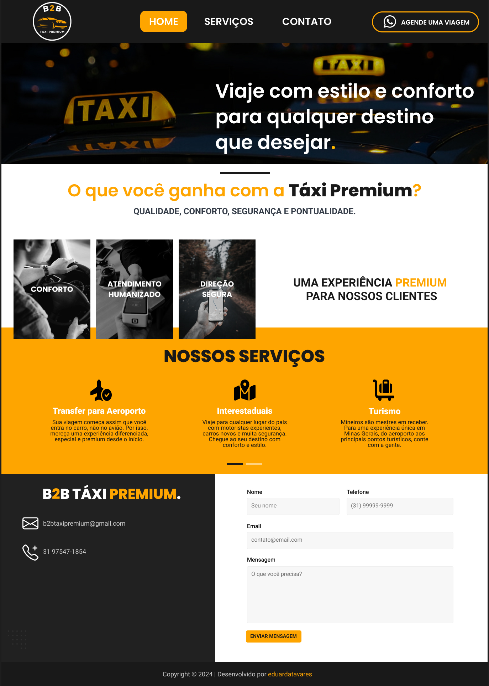

#B2B Taxi Premium Website 🚖✨

Bem-vindo ao repositório do **B2B Taxi Premium**, um site desenvolvido para facilitar o contato entre passageiros e taxistas! 🌟

## 🛠 Tecnologias Utilizadas
- **HTML5** e **CSS3** para estrutura e design responsivo
- **Bootstrap** para layout e componentes visuais
- **jQuery** para funcionalidades interativas
- Integração com **WhatsApp API** para contato direto
- Validação e envio de formulários com suporte a e-mail

## 📋 Funcionalidades
- Contato rápido via WhatsApp
- Formulário de contato com validação e envio de e-mail
- Layout limpo e responsivo, acessível em dispositivos móveis

## 🎨 Protótipo
Aqui está uma prévia do protótipo que criei no Figma, onde o site foi fielmente implementado:

## 🚀 Deploy
O site está hospedado e acessível via Vercel:
👉 [B2B Taxi Premium](https://b2btaxipremium.vercel.app/)

---

Espero que gostem! Qualquer feedback ou sugestão é bem-vindo. 😊
